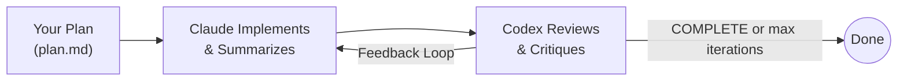
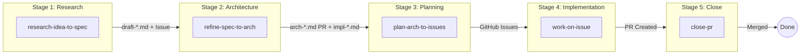
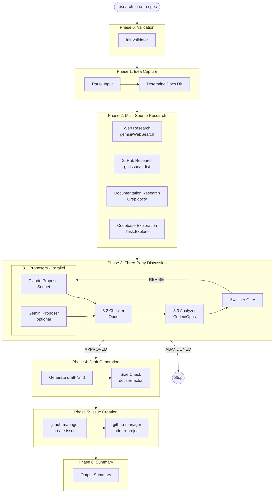
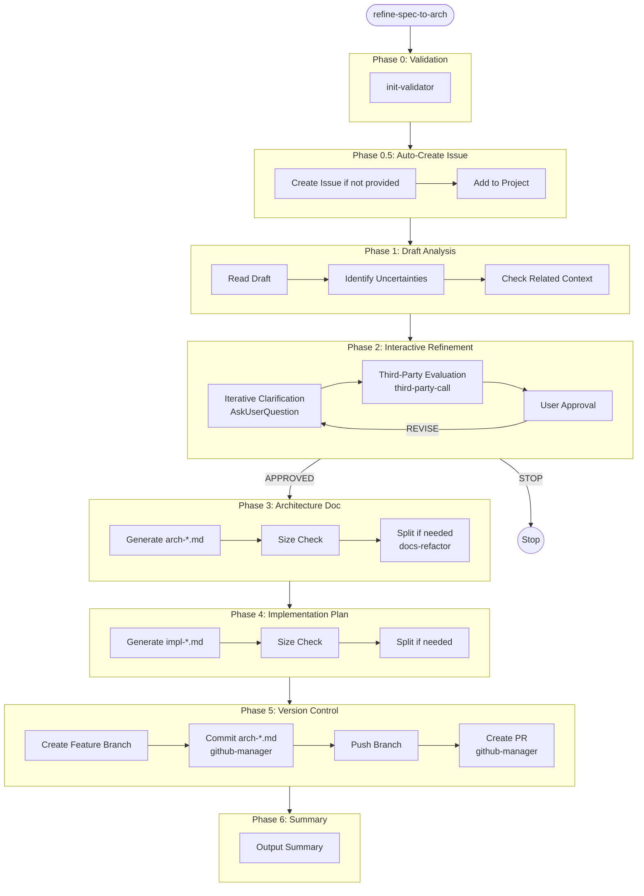
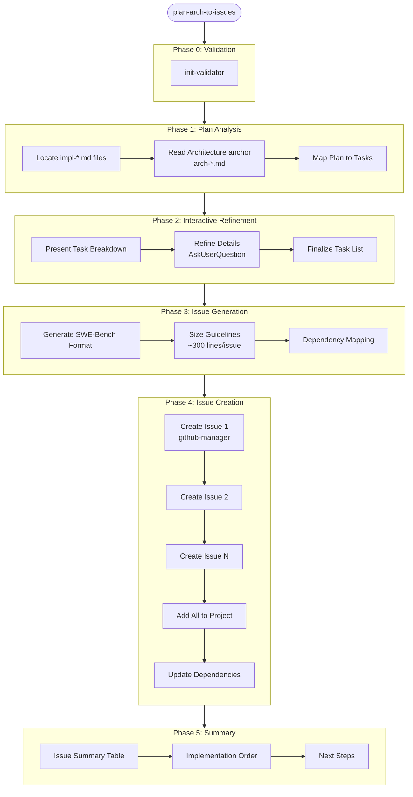
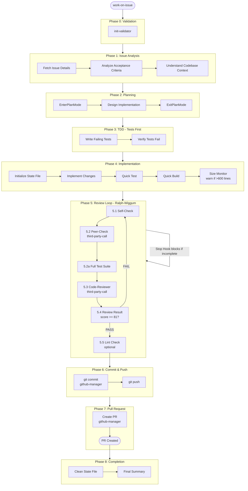
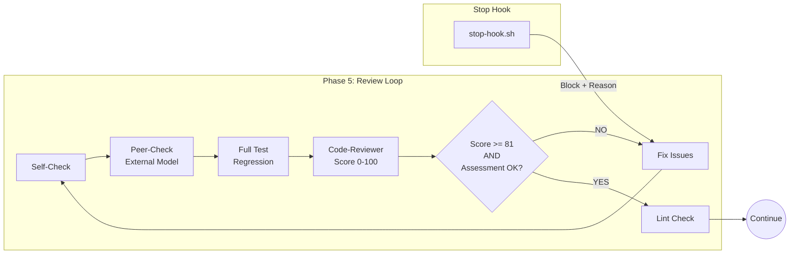
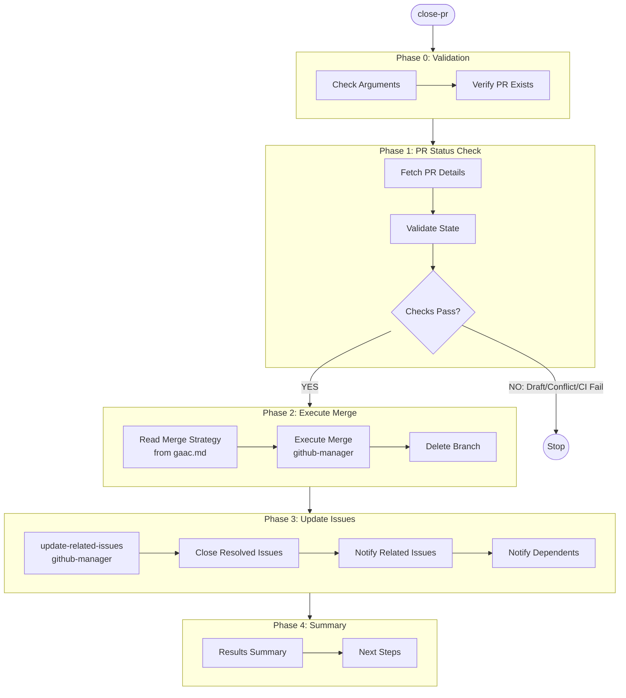
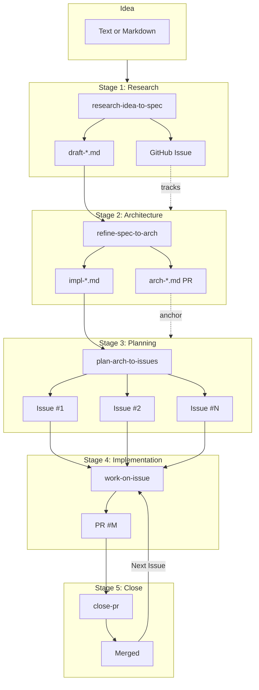

# GAAC - GitHub as a Context

**Current Version: 1.1.5**

A Claude Code plugin that implements the "GitHub as a Context" methodology for AI-native software development. GAAC uses GitHub's native features (Issues, PRs, Projects) as persistent context storage for LLM coding agents, providing a structured workflow from research to implementation.

## Core Philosophy

**GitHub as Context**: Instead of relying on local files for persistent context, GAAC leverages GitHub's existing infrastructure:
- **Issues** for tracking research, architecture, and implementation tasks
- **Pull Requests** for code review and integration
- **Projects** for progress tracking and organization
- **Comments** for discussion and decisions

This approach provides:
- Persistent context that survives session boundaries
- Collaboration between human and AI developers
- Audit trail of all decisions
- Integration with existing GitHub workflows

## Quick Start: Iterative Development with Codex Review

The `loop-with-codex-review` command demonstrates GAAC's core philosophy: **Iteration over Perfection**. Inspired by the [Ralph Wiggum technique](https://ghuntley.com/ralph/), it creates an iterative feedback loop where Claude implements your plan while Codex independently reviews the work, ensuring quality through continuous refinement.

### How It Works



### Step 1: Create Your Plan

Use Claude's plan mode to design your implementation. Save the plan to a markdown file:

```bash
# In Claude Code, enter plan mode and describe your task
# Claude will create a detailed plan
# Save the plan to a file, e.g., docs/my-feature-plan.md
```

Your plan file should contain:
- Clear description of what to implement
- Acceptance criteria
- Technical approach (optional but helpful)
- At least 5 lines of content

### Step 2: Run the Loop

```bash
# Basic usage - runs up to 42 iterations
/gaac:loop-with-codex-review docs/my-feature-plan.md

# Limit iterations
/gaac:loop-with-codex-review docs/my-feature-plan.md --max 10

# Run until Codex says COMPLETE (use with caution)
/gaac:loop-with-codex-review docs/my-feature-plan.md --infinite
```

### Step 3: Monitor Progress

All iteration artifacts are saved in `.gaac-loop.local/<timestamp>/`:

```bash
# View current round
cat .gaac-loop.local/*/state.md

# View Claude's latest summary
cat .gaac-loop.local/*/round-*-summary.md | tail -50

# View Codex's review feedback
cat .gaac-loop.local/*/round-*-review-result.md | tail -50
```

### Step 4: Cancel If Needed

```bash
/gaac:cancel-loop-with-codex
```

### Prerequisites

- `codex` CLI must be installed and available in PATH
- Plan file must exist and have at least 5 lines

This simplified workflow captures GAAC's essence: let AI iterate until quality is achieved, with independent review ensuring nothing is missed.

## Installation

### Option 1: Install from Git Marketplace (Recommended)

Start Claude Code and run the following commands:

```bash
# Add the marketplace
/plugin marketplace add git@github.com:SihaoLiu/gaac.git

# Install the plugin
/plugin install gaac@gaac-marketplace
```

### Option 2: Local Development / Testing

If you have the plugin cloned locally:

```bash
# Start Claude Code with the plugin directory
claude --plugin-dir /path/to/gaac
```

### Verify Installation

Run `/plugin` in Claude Code and check the **Installed** tab to confirm the plugin is active.

## Configuration

After installation, copy the configuration template to your project's `.claude/rules/` directory.

### For Marketplace Installation

```bash
cp ~/.claude/plugins/marketplaces/gaac-marketplace/templates/gaac-template.md .claude/rules/gaac.md
```

### For Local Installation

```bash
cp /path/to/gaac/templates/gaac-template.md .claude/rules/gaac.md
```

### Configure gaac.md

Edit `.claude/rules/gaac.md` and configure the following:
- GitHub repository URL
- GitHub project board URL
- L1/L2 tag system for your project
- Documentation paths
- Build and test commands

## Workflow Overview

GAAC implements a five-stage development workflow from idea to merged PR:

```
Research → Architecture → Planning → Implementation → Close
   ↓           ↓            ↓            ↓              ↓
draft-*.md  arch-*.md    Issues      PR Created     PR Merged
```



---

### Stage 1: `/research-idea-to-spec`

Transform ideas into draft specifications through multi-source research and three-party discussion.



**Output**: `draft-*.md` (unstaged) + GitHub Issue (added to project)

---

### Stage 2: `/refine-spec-to-arch`

Refine drafts into architecture documents and implementation plans.



**Output**: `arch-*.md` (committed, PR created) + `impl-*.md` (unstaged)

---

### Stage 3: `/plan-arch-to-issues`

Convert implementation plans into test-driven GitHub issues.



**Output**: Multiple GitHub Issues (SWE-bench format, added to project, with dependencies)

---

### Stage 4: `/work-on-issue`

Complete end-to-end issue resolution with Ralph-Wiggum enhanced review loops.



**Review Loop Detail** (Ralph-Wiggum Enhanced):



**Output**: PR resolving the issue (linked with `Resolves #N`)

---

### Stage 5: `/close-pr`

Merge PR with validation and update all related issues.



**Output**: PR merged, issues closed/notified, branch deleted

---

## Complete Workflow Integration



| Stage | Command | Input | Output |
|-------|---------|-------|--------|
| 1 | `/research-idea-to-spec` | Idea text/file | `draft-*.md` + Issue |
| 2 | `/refine-spec-to-arch` | `draft-*.md` | `arch-*.md` (PR) + `impl-*.md` |
| 3 | `/plan-arch-to-issues` | `impl-*.md` | Multiple Issues |
| 4 | `/work-on-issue` | Issue # | PR (linked to issue) |
| 5 | `/close-pr` | PR # | Merged + Issues closed |

## Commands

| Command | Purpose |
|---------|---------|
| `/research-idea-to-spec <idea>` | Transform idea into draft specification |
| `/refine-spec-to-arch <draft.md>` | Create architecture and implementation plans |
| `/plan-arch-to-issues <impl-*.md>` | Generate test-driven GitHub issues |
| `/work-on-issue <number>` | Implement issue with review loops |
| `/git-commit [message]` | Create commit with GAAC format |
| `/resolve-pr-comment [pr]` | Resolve PR review feedback |
| `/update-related-issues <number>` | Update related issues after PR merge |

## Skills

| Skill | Purpose |
|-------|---------|
| `init-validator` | Validate prerequisites and arguments |
| `github-manager` | GitHub operations (issues, PRs, projects) |
| `docs-refactor` | Document splitting and link validation |
| `third-party-call` | External AI tool invocation |

## Ralph-Wiggum Integration

The `/work-on-issue` command includes Ralph-Wiggum style iteration for the review phase:

1. Implementation complete → Enter review loop
2. Self-check → Peer-check → Self-review
3. If any check fails, Stop hook blocks exit
4. Claude receives issues and continues fixing
5. Loop until review passes or max iterations

### Configuration

- `MAX_RALPH_WIGGUM_ITER` environment variable (default: 50)
- Session isolation via `CLAUDE_SESSION_ID`

### Structured Markers

The Stop hook uses explicit markers for reliable detection:

| Marker | Format | Purpose |
|--------|--------|---------|
| Completion | `<gaac-complete>KEYWORD</gaac-complete>` | Signal task complete |
| Review Score | `<!-- GAAC_REVIEW_SCORE: NN -->` | Report self-review score |
| PR Created | `<!-- GAAC_PR_CREATED: N -->` | Report PR number |
| Issue | `<!-- GAAC_ISSUE: description -->` | Report specific issue |

Example completion: `<gaac-complete>WORK_ON_ISSUE_42_DONE</gaac-complete>`

## Project Board Integration

### Project Field Auto-Fill

When issues are added to the project board, GAAC can automatically set field values:

```
gaac.project_fields: Status=Todo, Priority=Medium, Effort=S
```

Supported field types:
- **Single Select**: Value must match an existing option name
- **Text**: Any string value
- **Number**: Numeric value (e.g., `StoryPoints=3`)
- **Date**: YYYY-MM-DD format

### Comment Attribution

GAAC can add an attribution prefix to all AI-generated issue and PR comments:

```
gaac.comment_attribution_prefix: *[Comment by Claude Code AI Agent]*
```

Use `--no-attribution` in scripts to skip the prefix when needed.

## Document Management

The `docs-refactor` skill provides document management capabilities:

| Feature | Script | Description |
|---------|--------|-------------|
| Size check | `check-doc-sizes.sh` | Report document sizes |
| Split | `split-document.sh` | Split large documents |
| Validate | `validate-links.sh` | Check all internal links |
| Move/Rename | `move-doc.sh` | Move document with link updates |

### Document Move/Rename

Move or rename a markdown document while automatically updating all links:

```bash
bash "${CLAUDE_PLUGIN_ROOT}/skills/docs-refactor/scripts/move-doc.sh" \
    --from ./docs/old.md --to ./docs/new.md

# Preview with dry-run
bash "${CLAUDE_PLUGIN_ROOT}/skills/docs-refactor/scripts/move-doc.sh" \
    --from ./docs/old.md --to ./docs/new.md --dry-run
```

## Prerequisites

Required tools:
- `gh` - GitHub CLI (authenticated)
- `jq` - JSON processor

Optional tools:
- `codex` - OpenAI Codex CLI (for peer review)
- `gemini` - Google Gemini CLI (for web research)

Check prerequisites:
```bash
bash <gaac-plugin>/skills/init-validator/scripts/check-prerequisites.sh
```

## Directory Structure

```
gaac/
├── .claude-plugin/
│   └── plugin.json          # Plugin manifest
├── commands/                 # Slash commands
│   ├── research-idea-to-spec.md
│   ├── refine-spec-to-arch.md
│   ├── plan-arch-to-issues.md
│   ├── work-on-issue.md
│   ├── git-commit.md
│   └── resolve-pr-comment.md
├── skills/                   # Skills with scripts
│   ├── init-validator/
│   ├── github-manager/
│   ├── docs-refactor/
│   └── third-party-call/
├── hooks/                    # Lifecycle hooks
│   ├── hooks.json
│   └── stop-hook.sh
├── templates/
│   └── gaac-template.md      # Configuration template
└── README.md
```

## What GAAC Does NOT Replace

The GAAC plugin provides methodology and commands, but does NOT replace your project's:

- **`.claude/rules/`**: Your project-specific rules and context (including gaac.md)
- **`CLAUDE.md`**: Project-level instructions and memories
- **`settings.json`**: Local IDE/Claude settings
- **Project hooks/**: Any project-specific hooks (GAAC hooks are additive)

GAAC is a methodology layer on top of your existing Claude Code setup. The `gaac.md` configuration file must live in your project's `.claude/rules/` directory.

## Design Principles

1. **Skills over Agents**: Prefer skills with scripts over sub-agents for deterministic behavior
2. **GitHub as Source of Truth**: All persistent state in GitHub, not local files
3. **Test-Driven Development**: Write tests before implementation
4. **Iteration over Perfection**: Use review loops to refine work
5. **Size-Appropriate PRs**: Target ~300 lines per PR
6. **Document Size Limits**: Max 1500 lines per document

## License

MIT

## Credits

- Ralph Wiggum technique: [Geoffrey Huntley](https://ghuntley.com/ralph/)
- Claude Code: [Anthropic](https://github.com/anthropics/claude-code)
